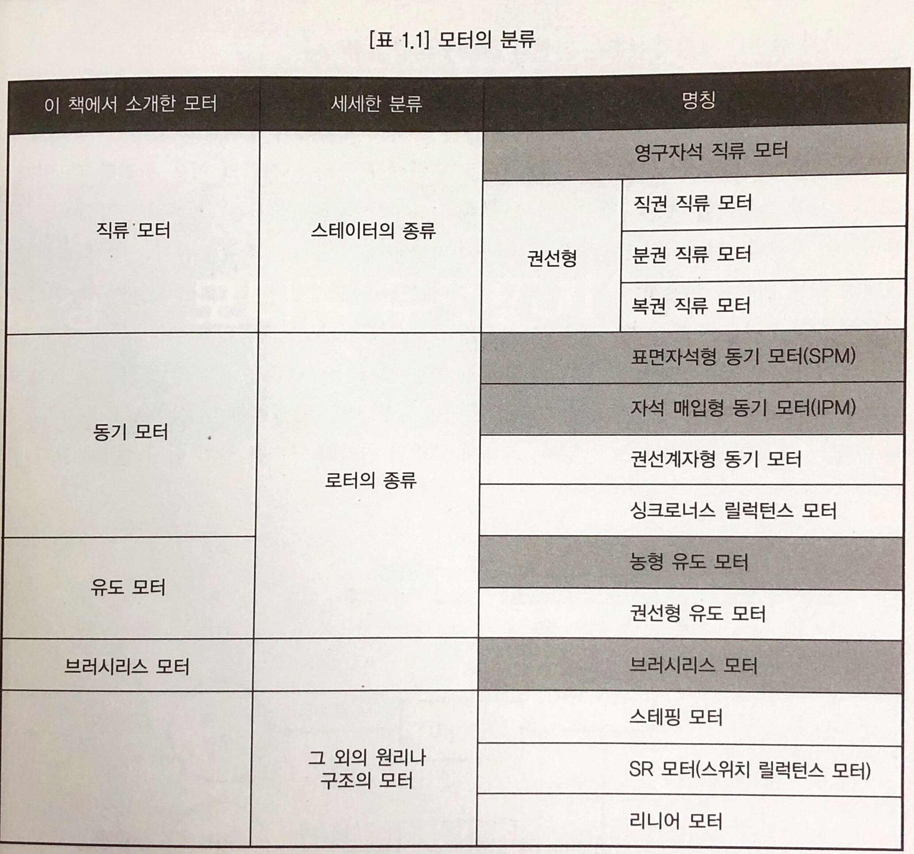
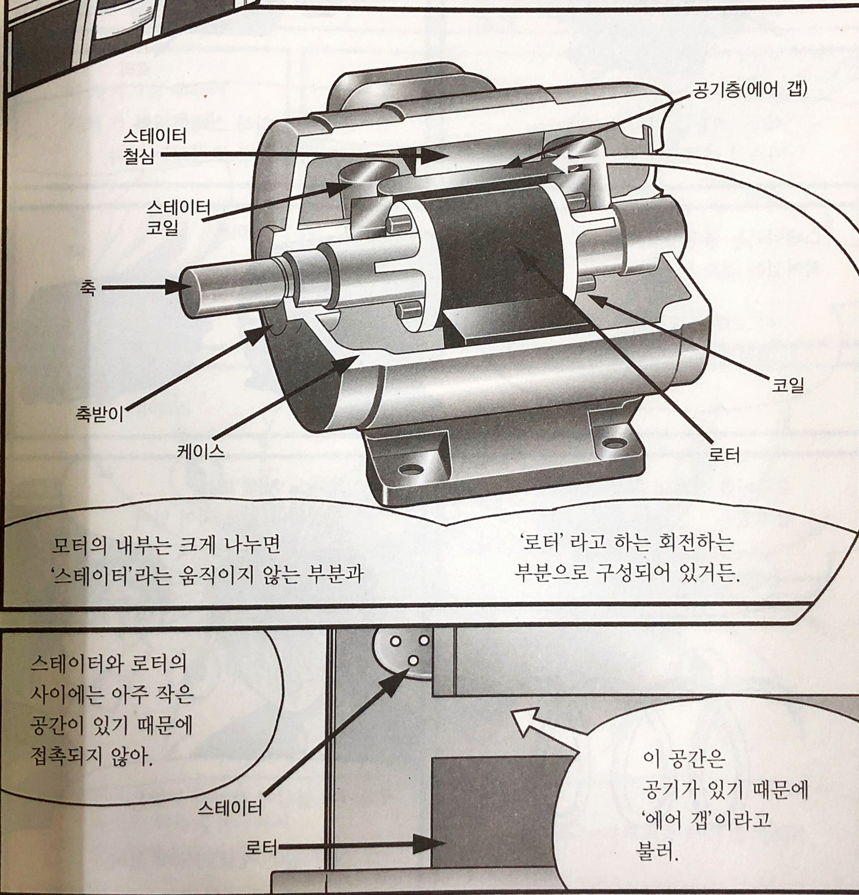
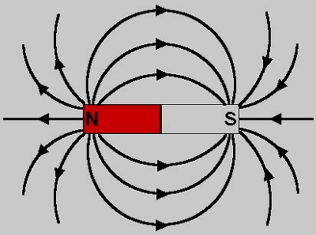
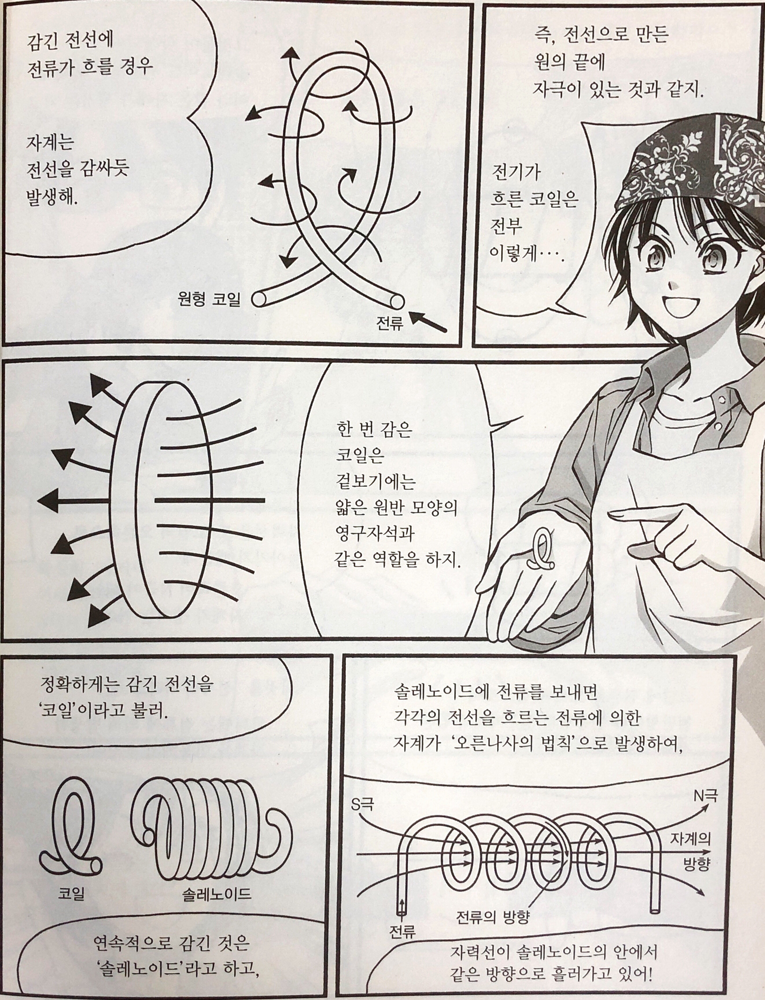
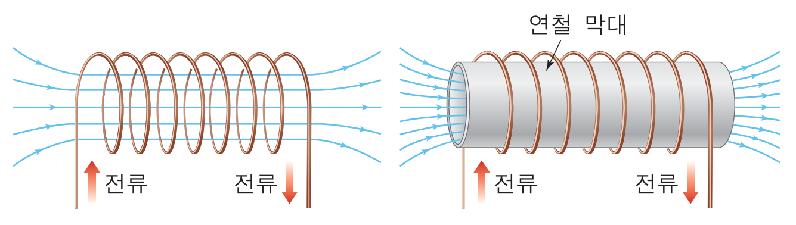

## 모터
### 1. 여러 종류의 모터
#### 1.1 모터는 어디에 사용될까?
> 일본의 1년 약1조kWh 발전된 전력의 반 이상을 모터를 돌리는데 사용됨. 모터의 효율 1%만 상승 해도 발전소 몇 군데는 불필요.(일본 만화라 일본을 기준으로 설명)

#### 1.2 자주 쓰이는 모터
1. 작은 기기에서 많이 쓰이고 있는 '직류 모터'
전지로 움직이는 모형 모터는 대부분이 이것
2. 소형 모터로서 가전제품이나 컴퓨터에 조립되어 있는 '브러시리스 모터'
3. 에어컨이나 하이브리드 자동차 등에 사용되는 '동기 모터'
4. 환기 팬이나 선풍기 같은 소형 제품에 이용되고 있는 '유도 모터'
5. SR 모터
6. 리니어 모터

| 분류  | 주로 이용되는 분야  | 주로 이용되는 크기  |
|-------|--------------------|--------------------|
| 직류모터  | 자동차, 오디오기기, 모형  | 초소형  |
| 브러시리스 모터  | 가전, 컴퓨터, 소형가전  | 소형  |
| 동기 모터  | 에어컨, 로봇, 전기자동차  | 소형~중형  |
| 유도 모터  | 펌프, 전차, 엘리베이터, 환기 팬  | 소형~  |

#### 1.3 모터가 진화하고 있다
1. 1984년 [**네오디뮴 자석**](https://namu.wiki/w/%EB%84%A4%EC%98%A4%EB%94%94%EB%AE%B4%20%EC%9E%90%EC%84%9D) (지구상 현존하는 가장 강력한 영구자석) 발명으로 소형화, 편평하게, 가늘고 긴 형태로 변화도 가능하게 되었다.
2. 절연게이트형 바이폴러 트랜지스터(IGBT)라고 하는 새로운 반도체의 출현으로 모터의 전류를 자유자재로 제어할 수 있게 되었다. - 절연 게이트 양그성 트랜지스터(Insulated gate bipolar transistor, IGBT)는 금속 산화막 반도체 전계효과 트랜지스터(MOSFET)을 게이트부에 짜 넣은 접합형 트랜지스터이다.
3. 모터를 제어하는 컴퓨터의 진보

> 기계실없는 엘리베이터: 옥상에 모터나 감속기를 설치하는 '기계실'이 필요했었다. 그래서 지하에 엘리베이터를 설치하려면 지상에 기계실이 필요했음.하지만, 네오디뮴 자석 덕분에 편평해진 모터가 엘리베이터 터널 안에 수납할 수 있도록 되어 컴퓨터 제어에 의해 모터를 저속으로 회전할 수 있게 되면서 감속기도 필요 없어지게 되었음.

> 감속기를 사용하지 않고 모터로 직접 회전하는 가동방식을 '다이렉트 드라이브'라고 하는데 이 기술의 진보 덕분에 '기계실 없는 엘리베이터', '지하에서 지하로'의 엘리베이터가 만들어지게 됨.

> 드럼 세탁기도 네오디뮴 자석으로 박형 모터가 실현되고 다이렉트 드라이브도 가능해져 주택에서 사용 가능하게 됨.

> 고층주택 옥상에 물 탱크가 없어진 것도 모터의 진화 덕분. 최근 펌프는 항상 작동해 바로 수압을 높여가면서 물의 사용에 따라 제어를 해서 수압을 유지

> 컬러 신문 인쇄 발전도...

#### Follow-up
##### 21세기의 모터
> 모터가 발명된 18세기에는 전류를 흐르게 하기 위한 전원은 직류 전류를 공급하는 전지밖에 없었다. 그때, 모든 모터는 직류 모터였다. 그 후 교류 발전기가 발명되고 나서야 교류 모터도 사용되게 되었다. 그 후 당초부터 어떤 전원으로 사용되는 ㅂ모터인가 하는 것이 문제가 되고, 직류 모터와 교류 모터로 분류하게 되었다.

##### 모터의 분류

### 2. 모터란 무엇인가?
#### 2.1 모터란?
> 전류를 흘려보내 모터를 회전시켜 전기 에너지를 운동 에너지로 변환하는 것이 모터

> 전기 에너지를 자기 에너지로 변환한 뒤 새롭게 운동 에너지로 변환. 자기를 사용하는 편이 전기에 의해 큰 에너지를 얻을 수 있음.

> 정전기처럼 전기 에너지도 물체를 움직일 수 있는 에너지는 발생하지만 정전기를 모아둔 정전 에너지는 절연능력 이상의 전압이 되면 방전되어 에너지가 날아가 버림. 대규모 방전이 바로 번개.

> 자기는 전기보다 에너지를 모으기 쉽다. 더 이상 자기력이 강해지지 않는 상태를 '자기포화'라고 하는데, 자기포화 되기 직전 자석은 자기로서 에너지를 정전 에너지의 40만 배 이상이나 모아둘 수 있다. - 자력은 도망가지 않는 '밀도가 높은' 에너지.

- 전기 > 자기 > 운동

#### 2.2 모터의 구조

- 스테이터와 로터
> 스테이터는 움직이지 않는 부분, 로터는 회전하는 부분

> 스테이터와 로터 사이에는 '에어 갭air gap'이라고 하는 작은 공간이 있어 접촉되지 않음.

> 스테이터 로터 외에 외측 케이스, 축 받이 등이 구조적 부품.

> 스테이터는 영구자석으로 되어있는 것도 있지만 철심과 코일로 이루어져 있는 것도 있음.

> 로터도 자석 또는 철심과 코일로 되어 있음. 자석이나 철심에 감겨진 코일은 모두 같은 재료.

#### 2.3 모터가 돌아가는 원리
- 전기와 자기의 관계
> 전선에 전류가 흐르면 자석처럼 주위에 '자계'가 생기게 됨. '자장'이라고도 하는데 공간에 '자기'가 발생해 있다는 것.

> 자석의 외측에 N극에서 S극 방향으로 자력선이 향하기 때문에 쇳가루는 자력선을 따라 흩어짐.

> 전류가 흘렀을 때 그 주위에 생기는 자계는 '오른나사의 방향'으로 발생

> 전류를 흘려보냄으로써 전기의 에너지는 저기 에너지로 변환.

> 코일 처럼 감긴 전선에 전류가 흐를 경우 자계는 전선을 감싸듯 발생. 전선으로 만든 원의 끝에 자극이 있는 것과 같아짐. 얇은 원반 모양의 영구자석과 같은 역할을 함.

> 연속적으로 감긴 것은 '솔레노이드'라고 함.

> 솔레노이드에 전류를 보내면 각각의 전선을 흐르는 전류에 의한 자계가 '오른나사의 법칙'으로 발생하여, 자력선이 솔레노이드의 안에서 같은 방향으로 흘러감.

> 그것들이 합성되어 솔레노이드 전체로는 외측에 아래와 같이 자계가 생김.

> 코일에 전류를 흐르게 함으로써 원판형이나 원통형의 영구자석과 같은 자계가 발생하게 된다. - 이것을 '전자석'이라고 한다.

> N극 S극이 서로 끌어당기는 '자기흡인력'과 같은 극이 밀어내는 '자기반발력'과 같은 '자기력'이 있고,

> '전자력'이라고 하는 힘도 발생시킴.
- 전자력
> 자석 사이 자계가 있는 도체(전선)에 전류를 흘려보내면 도체의 위쪽으로 힘이 작용하는데 이것이 '전자력'이다. - 플레밍의 왼손 법칙

> 전자력으로 모터를 돌리는 도움이 된다.

#### 2.4 발전기와 모터
> 회전력 -> 전기

> 도체가 자계 안에서 움직이면 도체 양 끝에 전압이 발생. 이것을 '기전력'이라고 함. 기전력의 방향은 플레밍의 오른손 법칙으로 알 수 있음.

> 기전력이 발생한 도체의 플러스와 마이너스를 회로에 연결하면 전류가 흘러가게 됨.

> 이렇게 만들어진 전기는 운동의 속도에 비례하기 때문에 '속도 기전력'이라고 함.
#### 2.5 토크란?
> 모터가 발생시키는 힘은 회전력

> F=ma 에서 힘에 해당하는 것이 토크

#### Follow-up
##### 자계란?
##### 모터는 왜 돌아가는가?
> 모터가 도는 원리에 대해서는 전기와 자계에 의해 생기는 네 가지 힘을 이해할 필요가 있다. - 두가지 기전력과 두 가지의 전자력

- 변압기 기전력
> 코일과 자속(자계의 세기와 방향을 나타낸 자력선속)이 쇄와 같이 서로 교차한 상태에 있을 때, 코일과 자속은 쇄교해 있다고 한다.

> 코일과 자계가 쇄교할 때 자속의 크기가 변화하면 코일에 기전력이 생긴다. 자계가 커지거나 작아지거나 하면 코일에 전류가 흐르는 힘이 생긴다는 것이다. 이 현상을 전자유도라고 한다.

> 전자유도에 의해 코일에 생기는 기전력은 유도기전력이라고 한다. 유도기전력의 크기는 자속의 변화하는 속도에 비례한다. 이것을 '패러데이의 법칙'이라고 한다.

> 코일에 쇄교하는 자속이 어떤 시간의 사이에 변화했을 때 전자유도에 의해 생겨난 유도기전력은 아래와 같은 식으로 나타낸다.
![유도기전력 공식](./image/induced_electromotive_force.jpg

> ...

##### 토크의 계산
> 회전력 = 토크

> SI 단위계에서 토크의 단위는 N * m 이다.
1 kgf * m = 9.8 N * m

### 3. 직류 모터

#### 3.1 직류 모터의 원리

> 직류 모터는 영구자석이 스테이터로 회전하는 코일을 로터에 이용하는 모터. 전자력을 이용하여 자계 안에 있는 코일만이 회전함.

> 코일은 자석의 N극 S극 경계까지 오면 그 이상은 회전하지 않으나 여기서 전류의 플러스, 마이너스의 방향을 바꾸면 계속 같은 방향으로 회전

> 전류의 방향을 세밀하게 바꾸는 것은 '브러시'와 '정류자'. 

#### 3.2 직류모터의 구조
#### 3.3 직류 모터의 회전을 변환하다
#### Follow-up
##### 직류 모터가 왜 돌아가는 걸까?
##### 토크 상수와 기전력 상수
##### 직류 모터의 등가회로와 제어방법
### 4. 브러시리스 모터
#### 4.1 브러시란?
#### 4.2 브러시리스 모터의 원리
#### 4.3 브러시리스 모터의 구조
#### Follow-up
##### 브러시의 작용
##### 브러시리스 모터는 왜 회전할까?
##### 스위치에 의한 브러시의 위치 전환
##### 브러시리스 모터의 센서
##### [칼럼] 브러시리스 모터라는 명칭
### 5. 동기 모터
#### 5.1 교류 전류
#### 5.2 회전하는 자계
#### 5.3 동기 모터의 원리
#### Follow-up
##### 교류전류란?
##### 교류전류와 회전하는 자계
##### 동기 모터가 어떻게 돌아가는가?
##### 동기 모터의 구조
##### [칼럼]인덕턴스
### 6. 유도 모터
#### 6.1 유도 모터의 원리
#### 6.2 유도 모터의 구조
#### 6.3 유도 모터의 특성
#### Follow-up
##### 왜 유도 모터가 회전하는가?
##### 유도 모터의 구성
##### 유도 모터의 성능
##### [캄럼] 임피던스
### 부록 기타모터
#### 스테핑 모터
#### SR 모터
#### 리니어 모터
