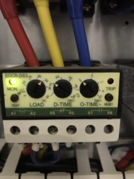

## Smart EOCR

### EOCR(Electronic OverCurrent Relay)
- 일반적으로 모터 보호용으로 사용되는 전자 과부하 계전기
- 기존에는 열동형 계전기(Thermal Relay)가 사용 되었는데 EOCR로 대체되는 추세

- LOAD, D-TIME, O-TIME 3가지 기능
> LOAD: 회로의 과전류 보호를 위해 설정하는 것으로 모터의 전격전류 혹은 정상운전전류를 기준으로 하여 과전류를 설정한다. 
> 일반적으로 정격전류의 125~150%정도에 설정한다. 설정된 전류치 이상으로 흐르게 되면 일정시간 후(O-TIME의 설정시간 후) 트립되어 회로를 보호한다.

> O-TIME: EOCR이 과전류를 감지해서 트립될 때까지의 시간을 의미한다. 일반적으로 4~6초 정도로 설정한다.

> D-TIME: 기동시간 지연 시간으로 기동방법중 직입기동(전전압기동)으로 시동하게 되면 기동전류는 전부하 전류의 500 ~ 700%정도가 되어 순간적으로
> 매우 큰 기동전류가 흐르게 된다. 일반적으로 3 ~ 5초 정도로 설정한다. 설정 시간 이상으로 흐르게 되면 트립되어 기기를 보호하고자 하는 목적으로 사용된다.

### Smart EOCR(IoT EOCR): UYeG-ZE/ME

