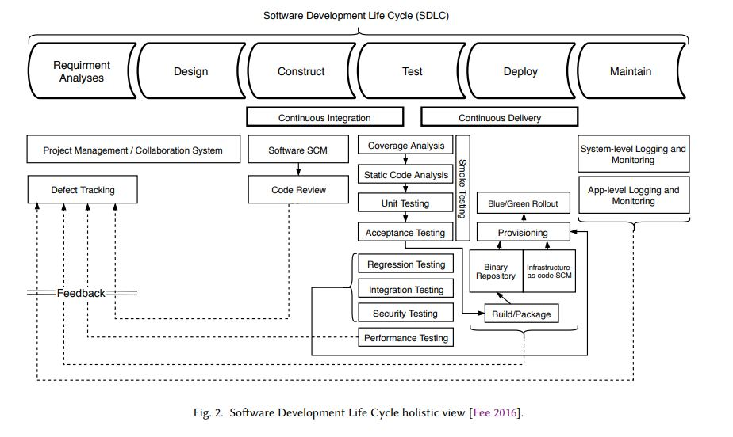
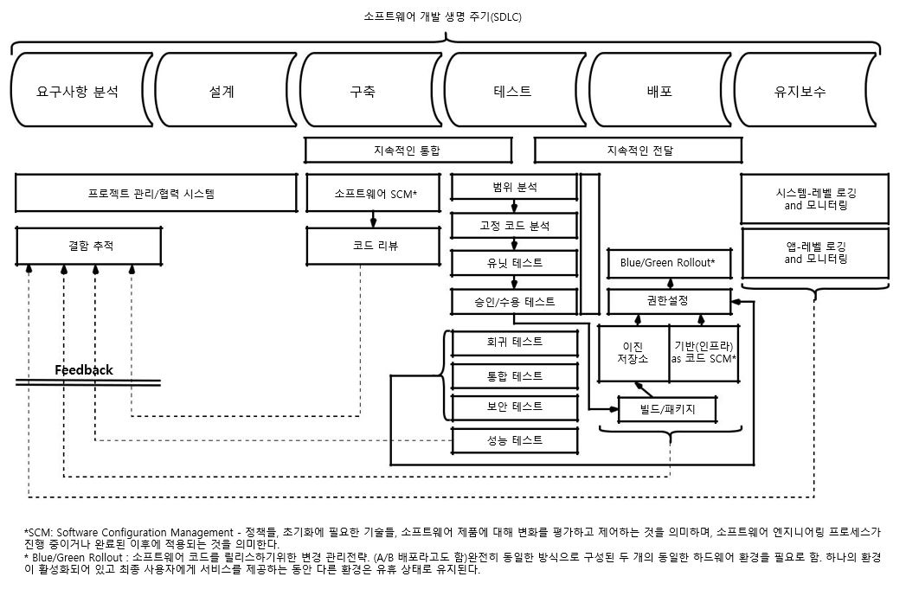
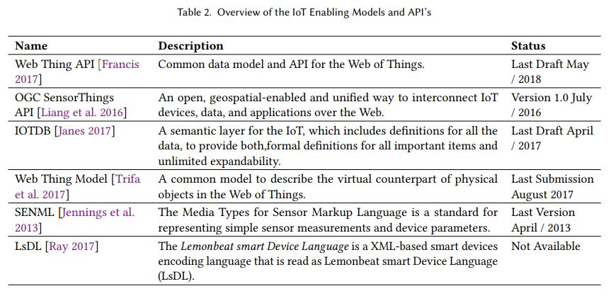

## State of the Software Development Life-Cycle for the Internet-of-Things

- JOÃO PEDRO DIAS, Faculty of Enginnering, University of Porto, Portugal 
- HUGO SERENO FERREIRA, Faculty of Enginnering, University of Porto, Portugal

원문<https://arxiv.org/abs/1811.04159>

 소프트웨어는 성공률을 고려하여 위기 상황과 오랜 연관성이 있습니다. 인터넷 연결 장치 (Internet-of-Things)의 폭발적 증가로 인해 소프트웨어 시스템이 복잡해졌습니다. 대규모 시스템과 이질성 시스템과 같은 시스템의 특성은 점차 새로운 도전 과제를 제기합니다. 이 논문에서는 먼저 소프트웨어 개발의 IoT 패러다임과 현재의 상태를 간략하게 소개한다. 그런 다음, IoT 시스템 및 시스템 시스템 용 소프트웨어를 개발하는 특이성에 대해 살펴보고, 그러한 시스템을 설계, 개발 및 테스트하기위한 현재의 방법론 및 도구가 무엇인지 살펴 봅니다. 발견 된 내용을 토의하여 미해결 문제와 연구 방향을 밝히고 요즘 IoT 소프트웨어 개발 사례가 현재 베스트 프랙티스보다 뒤떨어져 있음을 밝힙니다.

CCS 개념 : • 소프트웨어 및 엔지니어링 → 소프트웨어 생성 및 관리; 초대형 시스템; 개발 프레임 워크 및 환경; 소프트웨어 테스트 및 디버깅; • 컴퓨터 시스템 조직 → 임베디드 및 사이버 물리적 시스템;

추가 핵심 단어 및 구문 : 소프트웨어 엔지니어링, Internet-of-Things

ACM 참조 형식:
João Pedro Dias와 Hugo Sereno Ferreira. 인터넷의 사물에 대한 소프트웨어 개발 생명주기의 상태. ACM 계산. Surv. 9, 4, Article 39 (2018 년 3 월), 38 쪽. https://doi.org/0000001.0000001

1. 소개

소프트웨어는 성공률을 고려하여 위기 상황과 장기간 관련되어 있습니다. 개발자의 관점에서 소프트웨어 시스템을 개발하는 것은 어렵습니다. 개발자는 이러한 시스템을 개발하는 동안 버그를 도입하는 경향이 있습니다.

최근 유비쿼터스 연결 및 컴퓨팅의 최고봉 인 IoT (Internet-of-Things)라고도하는 컴퓨팅 기능을 갖춘 인터넷 연결 장치가 폭발적으로 늘어남에 따라 소프트웨어 시스템이 복잡해졌습니다. IoT의 주요 성공 요소 중 하나는 사용 가능한 장치 및 서비스가 원활하게 상호 연결될 수 있는지 여부에 달려 있습니다.
그러나 이것은 이미 소프트웨어 프로젝트 개발의 성공률에 영향을 미칠 수있는 복잡성의 증가로 이어집니다. IoT 시스템의 본질은 (1) 초대형, (2) 고도로 동적 인 토폴로지, (3) 매우 이질성이있는 것, (4) 멀티 도메인 특성을 특징으로합니다. 함께, 그것들을 설계, 개발 및 유지하는 방법에 대한 점점 더 많은 새로운 도전이 제기됩니다.

본고에서는 소프트웨어 개발 라이프 사이클의 3 단계, 즉 소프트웨어 시스템의 설계, 개발 및 테스트에 초점을 맞추어 IoT의 소프트웨어 엔지니어링 관행의 현재 상태에 대한 분석을 탐구합니다.

2 배경

2.1 인터넷의 것

Internet-of-Things (IoT)는 인터넷 구조 내에서 고유하게 식별 가능한 객체 (사물)와 가상 표현으로 구성된 패러다임입니다 [Barricelli and Valtolina 2015]. 대체로, 이것은 장치의 문맥 인식, 감지 기능 및 자율과 함께 일반 장치 간의 상호 연결성을 나타냅니다 [Hossain et al. 2015]. IoT에 관한 글로벌 표준 구상 (IoT-GSI)은 IoT를 정보 사회의 기반 시설로 정의한다 [Kafle et al. 2016], 새로운 스마트 공간으로의 진보를 예견 함 [Korzun et al. 2013]에 의해 유비쿼터스 컴퓨팅 [Friedemann and Floerkemeir 2011]의 수단에 의해 개발되었다.

IoT 패러다임은 삶과 삶의 질을 향상시키는 스마트 도시, 인프라 및 서비스의 실현을 가능케하는 사물과 인간 사이의 새로운 유형의 상호 작용을 구축 할 새로운 혁신에 대한 문호를 열어줍니다. 따라서 IoT는 도시와 인프라의 관리가 덜 복잡하고 의료 서비스가 편리하게 접근 가능하며 재해 복구가보다 효율적이기 때문에 삶의 질이 향상되는 새로운 연결 장치 및 인간 세계를 구상합니다 [Buyya and Dastjerdi 2016] .
기술적 측면에서 볼 때, IoT의 주요 역할은 매우 복잡한 지식 기반 및 동작 지향 응용 프로그램을 실시간으로 제공한다는 점을 고려할 수 있습니다. 이러한 목표를 달성하기 위해서는 개념화에서 개발, 테스트, 배포 및 유지 관리에 이르기까지이 시스템의 전체 수명주기를 고려할 때 몇 가지 고려 사항을 수행해야합니다. 여기에는 확장 가능한 아키텍처 개발, 폐쇄 시스템에서 개방 시스템으로 이동, 개인 정보 및 윤리적 문제 (데이터 감지와 관련되어 있기 때문에), 이질 지원, 데이터 저장, 데이터 처리, 의사 결정 등이 포함됩니다. , 자원 관리, 데이터 및 네트워크 관리, 실시간 필수품, 전력 및 에너지 관리, 거버넌스 및 상호 운용성 [Buyya and Dastjerdi 2016]을 비롯한 다양한 분야의 전문가들로 구성되어 있습니다.
IoT와의 얽힌 개념은 WoT (Web of Things)입니다. WoT는 실제 객체를 World Wide Web의 일부로 사용할 수있는 접근 방식, 소프트웨어 아키텍처 스타일 및 프로그래밍 패턴을 설명하는 데 사용되는 용어입니다. 간단히 말하면 웹 (응용 계층)이 인터넷 (네트워크 계층)과 비슷하게 Web of Things는 IoT 응용 프로그램의 생성을 단순화하는 응용 계층을 제공합니다.

2.1.1 간략한 역사 및 비전. ARPANET1에 의한 인터넷의 탄생 후 거의 50 년 [Perry et al. 1988], 인터넷이라는 용어는 정교하고 상호 연결된 컴퓨터 네트워크 위에 구축 된 광대 한 범주의 응용 프로그램 및 프로토콜을 말하며 24/7 사용 가능하며 2016 년경 전세계 35 억 사용자에게 서비스를 제공합니다 [Int 2017; Buyya and Dastjerdi 2016].

오늘날 유비쿼터스 컴퓨팅 (ubicomp, 퍼베이시브 컴퓨팅)과 유비쿼터스 연결성은 더 이상 꿈도 도전도 아닌 것으로 생각할 수 있습니다. 유비쿼터스 계산은 장치, 위치 및 형식에 관계없이 언제 어디서나 볼 수 있습니다. 또한 언제 어디서나 유비쿼터스 연결을 통해 모든 사람과 모든 사람이 연결할 수 있습니다.

퍼베이시브 컴퓨팅의 결과로, 사람을 연결하고 모든 사람이 컴퓨팅을 사용할 수 있도록하는 목표에서 인간과 가상 환경으로 물리적 영역을 수렴하기 위해 사람과 장치가 매끄럽게 통합되는 방향으로 초점이 옮겨졌습니다. 이 현상은 IoT (Internet-of-Things) 유토피아로 알려져 있습니다.

역사적인 관점에서 볼 때, Internet-of-things라는 용어는 공급망 관리 및 컴퓨터를 관찰하고 식별하고 이해할 수있게 해주는 RFID (Radio-Frequency Identification) 기술의 사용에 관한 프레젠테이션 중에 Kevin Ashton (1999 년경)에 의해 만들어졌습니다. 세계를 (인간이 입력 한 데이터의 제한없이) 2, 컴퓨터를 제외하고는 오래 전에 실제로 인터넷에 연결되었습니다.

따라서 유비쿼터스 컴퓨팅을 뛰어 넘는 IoT의 탄생에서 중요한 요소는 유비쿼터스 연결이었습니다. 따라서 IoT는 컨텍스트를 인식하고 다른 엔티티와 통신 할 수있는 다른 모든 개체를 고려합니다. 초기에는 RFID가 IoT 개발의 주요 기술 이었지만 오늘날에는 무선 센서 네트워크 (WSN) 및 Bluetooth 지원 장치가 IoT 추세의 주류 채택을 증가 시켰습니다 [Kevin 2009].

IoT는 기계 대 기계, 인간 대 기계 및 인간과 환경 간의 상호 작용의 원동력으로 확인되었습니다. 따라서 IoT는 인간과 사물이 시너지적이고 협조적인 방식으로 작동하는, 소위 말하는 휴먼 - 인 - 더 - 루프 (in-the-loop) 시스템에 힘을 실어 준다 [Stankovic 2014]. 새로운 애플리케이션이 인간과 밀접하게 관련되면서 에너지 관리 및 자동차 시스템을 비롯한 광범위한 애플리케이션에 대한 새로운 기회가 등장합니다. 그러나 John Stankovic이 지적한 인간 - 인 - 더 - 루프 (human-in-the-loop)의 몇 가지 문제는 휴먼 - 인 - 더 - 루프 (human-in-the-loop) 컨트롤의 전체 스펙트럼에 대한 포괄적 인 이해의 필요성, 시스템 식별 또는 인간 행동 모델을 도출하고 인간 행동 모델을 피드백 제어의 공식 방법론에 통합하는 방법을 결정하는 다른 기술 [Stankovic 2014].

IoT의 핵심 비전은 Industry 4.0 initiative의 핵심 기술 구성 요소 인 Industrial IoT (IIoT)입니다. 대형 첨단 기술 회사가 선호하는이 형태의 IoT 애플리케이션은 프로세스에 대한 더 많은 데이터를 수집하는 방법으로 사물의 감지 및 작동 기능을 염두에두고, 기업이 문제를 신속하게 감지하고 해결하여 전반적인 비용과 시간을 절약 할 수 있도록한다 [Buyya and Dastjerdi 2016]. 예를 들어 제조 회사에서는 IIoT를 사용하여 공급망을 효율적으로 추적 및 관리하고 품질 관리 및 보증을 수행 할 수 있습니다.

IoT가 업계에 미칠 수있는 영향과 함께, IoT가 삶의 질을 향상시키는 데 미치는 영향도 예상됩니다 [Buyya and Dastjerdi 2016]. 의료 관점에서 볼 때, IoT는 원격 환자 모니터링을 가능하게하는 데이터 수집 촉진자 (예 : 심박수) 일 수 있습니다. 주변 보조 생활 [Dohr et al. 2010]. 또한 위해 환경 조건을 모니터링하면 당국이 주민들에게보다 잘 행동하고 경고하도록 데이터 통찰력을 제공 할 수 있습니다.

좀 더 연결된 세계에 대한 IoT 비전은 여러 회사와 조직에 의해 받아 들여졌습니다. 시스코는 2013 년 IoT를 넘어선 IoT (Internet of Everything)라는 용어를 "사람들, 프로세스, 데이터 및 사물을 모아 네트워크 연결을 이전보다 더 중요하고 가치있게 만들었습니다. 더 많은 경험, 기업, 개인 및 국가를위한 유례없는 경제적 기회 창출 "[cis 2018]. 곧 IoE에 대한 시스코의 개념은 사람 (관련성이 높고 가치있는 방식으로 사람들을 연결), 데이터 (정보를 더 나은 결정을 내리기 위해 인텔리전스로 변환), 프로세스 (올바른 사람 또는 컴퓨터에 올바른 정보를 제공 올바른 시간), 그리고 사물 (소위 말하는 IoT).

현재 ISO (International Organization for Standardization)와 IEC (International Electrotechnical Commission) - ISO / IEC JTC 1 -의 공동 기술위원회는 인터넷 환경 (Internet-of-Things)의 정의를 수용했다 [ISO / IEC JTC 1 2014] :

물리적, 가상 세계에 대한 정보를 처리하고 반응 할 수 있도록 지능형 서비스와 함께 상호 연결된 객체, 사람, 시스템 및 정보 자원의 인프라입니다.

2.1.2 응용 프로그램 시나리오. IoT는 모든 종류의 스마트 공간을위한 기반으로 작동하기 때문에 다양한 컨텍스트 및 시나리오에서 기술 혁신의 주요 촉진 요인이었습니다. 이러한 역할은 IoT를위한 많은 수의 응용 도메인을 확인한 CERP-IoT (Internet of Things)에 관한 유럽 연구 프로젝트 클러스터 (Sundmeker et al. 2010].

CERP-IoT 보고서 [Sundmaeker et al. 2010]은 표 1에 설명 된 바와 같이 세 가지 IoT 애플리케이션 도메인을 정의합니다. 이러한 애플리케이션 도메인 내에서 항공 우주 및 항공 (시스템 상태 모니터링, 친환경 운영), 자동차 (시스템 상태 모니터링, 지능형 빌딩 (자동 에너지 계량, 홈 오토메이션, 무선 모니터링), 헬스 케어 (개인 영역 네트워크, 매개 변수 모니터링, 위치 확인, 실시간 위치 시스템), 독립 생활 (자동차, 웰빙, 이동성, 인구 고령화 모니터링), 소매, 물류, 공급망 관리, 인력 및 물품 운송, 미디어, 엔터테인먼트 및 보험 등이 있습니다.

IoT Analytics GmbH 보고서 [Scully 2018]는 Smart City, Industrial IoT, Smart Building, Smart Car, Smart Energy / Grid, eHealth, Smart Supply Chain, Smart Agriculture, Smart Retail과 같은 가장 관련성이 높은 엔터프라이즈 급 IoT 세그먼트를 보여줍니다. 그 관련성은 그림 1의 차트에 나와 있습니다. 그러나이 보고서는 소비자 수준의 IoT 세그먼트 (예 : 웨어러블 및 스마트 홈)에 포함되지 않습니다.

Table 1. IoT Application Domains [Sundmaeker et al. 2010].

|Domain|Description|Indicative Examples|
|------|-----------|-------------------|
|Industry|Activities involving financial or commercial transactions between companies, organisations and other entities|Manufacturing, logistics, service sector, bank-ing, financial governmental authorities, inter-mediaries, etc.|
|Environment|Activities regarding the protection, monitoring and development of all natural resources|Agriculture & breeding, recycling, environmen-tal management services, energy management, etc.|
|Society|Activities/ initiatives regarding the develop-ment and inclusion of societies, cities and people|Governmental services towards citizens and other society structures (e-participation), e-inclusion (e.g. aging, disabled people), etc.|

|도메인|설명|지식적인 예시|
|------|-----------|-------------------|
|산업|기업, 조직 및 기타 기업 간의 금융 또는 상업적 거래를 수반하는 활동|제조, 물류, 서비스 부문, 은행업, 금융 정부 당국, 중개업 등|
|환경|모든 천연자원의 보호, 감시 및 개발에 관한 활동|농업 및 사육, 재활용, 환경-기술 관리 서비스, 에너지 관리 등|
|사회|사회,도시,사람들의 발전과포용에 관한 활동/시책|시민 및 기타 사회 구조(e-참여), 전자적폐(예: 고령화, 장애인 등)에 대한 정부 서비스|

Number of IoT Enterprise Projects per Segment
> 세그먼트당 IoT Enterprise 프로젝트 수

Fig. 1. Statistics based upon 1600 public known enterprise IoT projects circa 2018 (not including consumer level IoT projects such as werables and smart homes) [Scully 2018].

> 그림 1. 2018년 1천600개의 공공 IoT 프로젝트를 기반으로 한 통계(웨러블 및 스마트 홈과 같은 소비자 수준의 IoT 프로젝트 제외 [Scully 2018].

IoT 엔터프라이즈 애플리케이션은 또한 (Buyya 및 Dastjerdi 2016) 역할에 따라 모니터링 및 작동, 비즈니스 프로세스 및 데이터 분석, 정보 수집 및 협업 소비라는 세 가지 주요 범주로 집계 할 수 있습니다 .

오픈 IoT 기회와 다양한 애플리케이션 시나리오를 활용하면 사람들의 삶의 질을 향상시킬 수 있으며 한편으로는 업계와 기업의 세계를 향상시킬 수 있습니다.

2.2 소프트웨어 개발 생명주기

소프트웨어 개발 라이프 사이클 (SDLC)은 소프트웨어 시스템을 구축하거나 유지 관리하는 프로세스입니다. 일반적으로 예비 개발 분석 (예 : 요구 사항, 아키텍처 설계)에서 개발 후 소프트웨어 테스트 및 평가 (예 : 검증 및 검증)에 이르는 다양한 단계가 포함됩니다 [Leau et al. 2012].
ACM에 제출 된 원고

또한 SDLC는 개발 팀이 전체 개발 프로세스를 계획하고 제어하기위한 프레임 워크를 구성하는 소프트웨어 시스템을 개발하는 데 사용하는 모델과 방법을 포함합니다. 현재 SDLC 방법론 카테고리에는 전통적인 소프트웨어 개발 (예 : 폭포, Rational Unified Process)과 AGILE 소프트웨어 개발 (예 : SCRUM)의 두 가지 카테고리가 있습니다 [Leau et al. 2012]. 그림 2에는 SDLC에 대한 전체적인 견해가 나와 있습니다.

IoT 시스템의 설계, 구축, 테스트, 배치 및 유지 보수에 이르는 광범위한 SDLC 프로세스의 적용은 IoT 생태계 고유의 특성으로 인해 기존의 소프트웨어 시스템을 개발할 때 직면 한 것과 다른 도전에 직면 해 있습니다.

주로 기술적 관점에서 IoT에 관한 소프트웨어 엔지니어링 지식 체계에는 설계, 개발 및 테스트를 포함하되 이에 국한되지 않는 상당한 격차가 있습니다. 2 차적으로, 작업 팀의 관점에서, 개발자는 초대형 시스템에서 임베디드 시스템 프로그래밍에 이르는 광범위한 지식 기반을 가질 필요가 있습니다.

2.3 디자인 패턴

크리스토퍼 알렉산더 (Christopher Alexander)는 자신의 저서 「패턴 언어 (Pattern Language)」(1977 년경)에서 이와 같은 시간에 아키텍처와 도시 설계 솔루션을 문서화하는 방법으로 패턴의 개념을 제시했습니다 3. 그는 더 나아가 [Alexander et al. 1977] :

각 패턴은 우리 환경에서 반복적으로 발생하는 문제를 설명하고 그 문제에 대한 솔루션의 핵심을 설명합니다.이 솔루션을 백만 번 이상 사용할 수있는 방식으로, 같은 방식으로 두 번 반복하지 않아도됩니다 .

그의 연구에서 그는 <문제, 힘, 해답> 삼중 항을 뛰어 넘는 패턴 개념을 패턴 언어로 확장 시켰는데,이 언어는 또한 특정 영역에서 서로 다른 패턴 간의 관계를 고려합니다.

이러한 개념은 나중에 실질적인 지식과 경험을 포착하고 공유하는 방법으로 소프트웨어 엔지니어링 커뮤니티에 의해 빌려졌습니다 [Meszaros and Doble 1997]. 패턴은 특정 문제에 대한 반복적 인 해결책에 해당하며 특정 상황에서 힘의 집합 사이에서 최적의 균형을 이루면서 동시에 그 결과를 고려하여 널리 받아 들여지고 있습니다.

소프트웨어 공학에서 패턴의 사용은 고수준의 건축 패턴에서부터 디자인 패턴, 저수준의 숙어까지 다양하다 [Bushmann et al. 1996] :

• 아키텍처 패턴은 소프트웨어 시스템의 기본 구조 체계를 표현하고 하위 시스템으로 분해하여 책임과 상호 관계를 수립합니다.
• 디자인 패턴은 클래스, 관계 및 객체와 같은 객체 지향 디자인 요소 간의 상호 작용 관점에서 지정된 중간 규모의 전술 패턴으로 구체적인 상황에서 인스턴스화 할 일반 규범 템플릿을 제공합니다. 그것들은 전반적인 시스템 구조에 영향을주지 않고 서브 시스템과 구성 요소의 마이크로 아키텍처를 정의합니다.

• 관용구 (코딩 패턴이라고도 함)는 특정 프로그래밍 언어의 기능을 사용하여 구성 요소 또는 관계의 특정 측면을 구현하는 방법을 설명하는 저급 패턴입니다.
이러한 패턴 및 패턴 언어에 포함 된 지식은 흩어져있는 경험 지식을 체계적으로 분석하고 문서화하는 과정의 결과이며 개발자가 소프트웨어 인공물을 설계, 제작 및 관리하는 방식에 커다란 영향을 미칩니다.

3 DESIGNING THE INTERNET-OF-THINGS

3.1 Architectural Styles

감각 장치, 원격 서비스 호출, 통신 네트워크 및 이벤트의 컨텍스트 인식 처리와 같은 오랜 기간 동안 있었던 IoT 시스템을위한 몇 가지 기본 구성 요소가 있습니다. IoT 이니셔티브는 이러한 잘 알려진 빌딩 블록을 통일 된 방식으로 활용하려고하는데, 스마트 오브젝트와 스마트 오브젝트 (필요한 경우)를 조작 할 책임이있는 인간은 보편적으로 그리고 유비쿼터스 적으로 서로 통신 할 수 있습니다.

IoT를위한 전체 론적 시스템 아키텍처는 구성 요소의 완벽한 작동을 보증하고 실제 및 가상 영역을 통합해야합니다. 이러한 목표를 달성하기 위해 IoT 시스템은 신뢰할 수 있고 적응 가능해야하며 동적 상호 작용, 고도로 확장 가능하며 인간 중심적이어야한다 [Buyya and Dastjerdi 2016].

이 시스템은 통신 스타일과 디자인 측면에서 요즘 표준과 대부분 호환되는 아키텍처 스타일을 따릅니다. 따라서, IoT 시스템의 가장 보편적 인 기초는 웹 서비스로서, 웹 서비스가 구축되고 통신되는 방식에 영향을 미친다.

이와 같이 IoT 시스템은 일반적으로 Representational State Transfer (REST4) 아키텍처 또는 Simple Object Access Protocol (SOAP) 아키텍처를 기반으로합니다. 그럼에도 불구하고이 아키텍처는 SOA (Service Oriented Architecture)로, 임의의 작업 집합을 노출하여 일련의 서비스를 제공함으로써 이기종 장치 간 상호 운용성을 보장합니다. [Buyya and Dastjerdi 2016]

SOAP은보다 전통적인 아키텍처 스타일로, 대역폭면에서 무겁고 복잡하며 XML (eXtensible Markup Language) 데이터 교환 형식을 사용합니다. 반면에 REST는 JSON (JavaScript Object Notation) 데이터 교환 형식과 결합 된보다 유연하며 일반적으로 더 빠르며 더 적은 대역폭을 사용합니다.

IoT 시스템을 개발할 때 매쉬업 기반 및 모델 기반 [Prehofer and Chiarabini 2013, 2015]이라는 두 가지 주요 아키텍처 접근 방식이 있습니다. 매쉬업 기반 접근 방식에서 시스템은 기존 서비스를 구성하거나 매시업하여 개발됩니다. 따라서 매시업은 친숙한 웹 개발 도구 및 기술 (예 : 응용 프로그램 프로토 타이핑) [Blackstock and Lea 2012a]를 기반으로 개발 된 맞춤형, 상황 별, 단기 및 비업무 핵심 응용 프로그램에 주로 사용됩니다. 모델 기반 접근법은 더 높은 추상화 수준에서 시스템을 기술 할 수있는 능력을 기반으로하므로 코드 생성을 통해 시스템의 매우 표현적인 모델링을 가능하게합니다 [Prehofer and Chiarabini 2013, 2015]. 이 두 가지 접근 방식 (매쉬업과 모델 기반의 혼합)은 문헌에서 찾을 수 없습니다.

3.2	IoT Interoperability Standards

Different entities have been working on different standards to ensure an interoperable Internet-of-Things, simply put a common language that devices can speak between them and different applications, thus, reducing the IoT fragmentation. A summary of the most known initiatives is given on Table 2, and the most widespread are analysed in the following paragraphs.

3.2 IoT 상호 운용성 표준

상호 운용성있는 인터넷 -to-Things를 보장하기 위해 서로 다른 기업들이 서로 다른 표준을 사용하고 있으며, 단순히 장치가 서로 다른 응용 프로그램간에 말할 수있는 공용 언어를 넣어 IoT 단편화를 줄입니다. 가장 잘 알려진 이니셔티브의 요약은 표 2에 나와 있으며 가장 널리 보급 된 내용은 다음 단락에서 분석됩니다.

