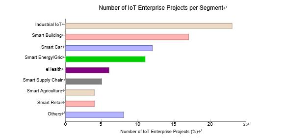

## State of the Software Development Life-Cycle for the Internet-of-Things

JOÃO PEDRO DIAS, Faculty of Enginnering, University of Porto, Portugal 
HUGO SERENO FERREIRA, Faculty of Enginnering, University of Porto, Portugal

>  Software has a longstanding association with a state of crisis considering its success rate. The explosion of Internet-connected devices

– Internet-of-Things – adds to the complexity of software systems. The particular characteristics of these systems, such as being large-scale and its heterogeneity, pose increasingly new challenges. In this paper, we first briefly introduce the IoT paradigm and the current state of art of software development. Then, we delve into the particularities of developing software for IoT systems and systems of systems, given an overview of what are the current methodologies and tools for design, develop and test such systems. The findings are discussed, revealing open issues and research directions, and reveal that the nowadays IoT software development practices are still lagging behind of what are the current best practices.

> 소프트웨어는 성공률을 고려할 때 오랜 기간 동안 위기 상태와 연관되어 있습니다. 인터넷에 연결된 장치가 폭발적으로 증가합니다.

– 인터넷은 소프트웨어 시스템의 복잡성을 가중시킵니다. 이러한 시스템의 특정 특성(대규모 및 이질성)은 점점 더 새로운 과제를 안고 있습니다. 본 논문에서는 먼저 IoT 패러다임과 소프트웨어 개발의 현황을 간략히 소개합니다. 그런 다음, IoT 시스템 및 시스템용 소프트웨어 개발의 세부 사항을 살펴보고, IoT 시스템 설계, 개발 및 테스트를 위한 현재의 방법론과 툴에 대해 간략하게 설명합니다. 이번 조사 결과에 대해 논의하면서 개방형 문제 및 연구 방향을 제시하고 있으며, IoT 소프트웨어 개발 관행은 현재 모범 사례에 비해 여전히 뒤쳐져 있습니다.

CCS Concepts: • Software and its engineering → Software creation and management; Ultra-large-scale systems; Development frameworks and environments; Software testing and debugging; • Computer systems organization → Embedded and cyber-physical systems;

Additional Key Words and Phrases: Software Engineering, Internet-of-Things

ACM Reference Format:

João Pedro Dias and Hugo Sereno Ferreira. 2018. State of the Software Development Life-Cycle for the Internet-of-Things. ACM Comput. Surv. 9, 4, Article 39 (March 2018), 38 pages. https://doi.org/0000001.0000001

CCS 개념: • 소프트웨어 및 엔지니어링 → 소프트웨어 생성 및 관리, 초대형 시스템, 개발 프레임워크 및 환경, 소프트웨어 테스트 및 디버깅, • 컴퓨터 시스템 구성 → 내장형 및 사이버 물리적 시스템입니다.

추가 키워드 및 페이스는 다음과 같습니다. 소프트웨어 엔지니어링, 인터넷 서비스 등의 다양한 기능을 제공합니다.

ACM 참조 형식은 다음과 같습니다.

조앙 페드로 디아스와 휴고 세레노 페레이라. 2018년입니다. 소프트웨어 개발 수명주기(Internet-of-Things)를 나타냅니다. ACM 계산. 9조 4항, 39조 (2018년 3월) 38쪽입니다. https://doi.org/0000001.입니다.0000001

1	INTRODUCTION

Software has a long-standing association with states of crisis considering its success rate. From a developer’s perspective, developing software systems is hard, and developers have a high-proneness for introducing bugs during the development of such systems.

The explosion of Internet-connected devices with computing capabilities, also known as the Internet-of-Things (IoT)

– the recent peak of ubiquitous connectivity and computing – adds to the complexity of software systems. One of the keys successes of IoT depends on the ability to seamlessly interconnect the plethora of available devices and services.
However, this comes with an increase in complexity that might further impact an already low success rate of software project development. The very nature of IoT systems is characterized by (1) being ultra-large-scale, (2) having highly-dynamic topologies, (3) being highly heterogeneous, and (4) their multi-domain nature. Together, they pose increasingly new challenges on how to design, develop and maintain them.

On this paper, we delve into an analysis on the current state of art of software engineering practices for the IoT, focusing in three phases of the software development life-cycle, namely, the design, develop and test software systems.

1. 도입

소프트웨어는 성공률을 고려했을 때 오랫동안 위기 상태와 관련이 있습니다. 개발자 입장에서는 소프트웨어 시스템 개발이 어렵고, 개발자들은 그러한 시스템 개발 중에 버그를 도입하는 경향이 강합니다.

IoT(Internet-of-Things)라고도 하는 컴퓨팅 기능을 갖춘 인터넷 연결 장치가 폭발적으로 증가합니다.

– 최근 유비쿼터스 연결 및 컴퓨팅이 최고조에 달하면서 소프트웨어 시스템의 복잡성이 가중되고 있습니다. IoT의 주요 성공 요인 중 하나는 수많은 사용 가능한 장치와 서비스를 원활하게 상호 연결하는 능력에 달려 있습니다.
그러나 이는 복잡성이 증가하여 이미 낮은 소프트웨어 프로젝트 개발 성공률에 더욱 영향을 미칠 수 있습니다. IoT 시스템의 본질은 (1) 초고대규모, (2) 고동적 토폴로지, (3) 고이종, (4) 다중 도메인 특성을 갖는 것이 특징입니다. 이 두 가지가 함께 설계, 개발 및 유지 보수 방법에 있어 점점 더 새로운 과제가 되고 있습니다.

본 논문에서는 IoT용 소프트웨어 엔지니어링 사례의 현황에 대해 살펴보고, 소프트웨어 개발 라이프사이클의 3단계, 즉 설계, 개발 및 테스트 소프트웨어 시스템을 중점적으로 분석합니다.

2 BACKGROUND

2.1	Internet-of-Things

Internet-of-Things (IoT) is a paradigm that consists of the uniquely identifiable objects (things) and their virtual represen-tations within the Internet structure [Barricelli and Valtolina 2015]. Broadly, it refers to the inter-connectivity between ordinary devices alongside with the device contextual awareness, sensing capability, and autonomy [Hossain et al. 2015]. Global Standards Initiative on IoT (IoT-GSI) defines IoT as the infrastructure of the information society [Kafle et al. 2016], foreseeing the advance towards new smart spaces [Korzun et al. 2013] by the means of ubiquitous computing [Friedemann and Floerkemeir 2011].

The IoT paradigm opens the doors to new innovations that will build a novel type of interactions among things and humans, enabling the realization of smart cities, infrastructures, and services for enhancing the quality of life and utilization of resources. Thus, IoT envisions a new world of connected devices and humans in which the quality of life is enhanced because management of the city and its infrastructure is less cumbersome, health services are conveniently accessible, and disaster recovery is more efficient [Buyya and Dastjerdi 2016].
From a technical point-of-view, one can consider that a major role of the IoT consists of the delivery of highly complex knowledge-based and action-oriented applications in real-time. In order to be able to reach such an end, several considerations should be done when considering the full life-cycle of this system, from conceptualization to development, from test to deployment and maintenance. These include, but are not limited to: development of scalable architectures, moving from closed systems to open systems, dealing with privacy and ethical issues (due to the involved in data sensing), heterogeneity support, data storage, data processing, decision-making, designing interaction protocols, autonomous management, communication protocols, smart objects and service discovery, programming frameworks and languages, resource management, data and network management, real-time necessities, power and energy management, governance and interoperability [Buyya and Dastjerdi 2016].
An intertwined concept with the IoT one is the Web of Things (WoT). WoT is a term used to describe approaches, software architectural styles and programming patterns that allow real-world objects to be part of the World Wide Web. In simple terms, similarly to what the Web (Application Layer) is to the Internet (Network Layer), the Web of Things provides an Application Layer that simplifies the creation of IoT applications.

2 백그라운드

2.1 Internet-of-Things

IoT(Internet-of-Things)는 고유하게 식별할 수 있는 객체(things)와 인터넷 구조 내의 가상 재설정으로 구성된 패러다임입니다 [Barricelli 및 Valtolina 2015]. 일반적으로, 기기 상황 인식, 감지 기능 및 자율성과 함께 일반 기기 간의 상호 연결성을 나타냅니다 [Hossain et al. 2015]. IoT에 대한 글로벌 표준 이니셔티브(IoT-GSI)는 IoT를 정보사회의 인프라로 정의하고 있습니다. [Kofle 등, 2016] 유비쿼터스 컴퓨팅을 통한 새로운 스마트 공간으로의 진보를 전망하고 있습니다 [Korzun 등, 2013년].

IoT 패러다임은 사물 및 인간 간의 새로운 상호작용 유형을 구축하여 스마트 시티, 인프라 및 서비스를 실현하여 삶의 질과 자원의 활용도를 높일 수 있는 새로운 혁신의 문을 열어줍니다. 따라서 IoT는 도시와 그 인프라의 관리가 덜 번거롭고, 의료 서비스에 편리하게 액세스할 수 있으며, 재해 복구의 효율성이 높아져 삶의 질이 향상되는 새로운 연결 장치 및 인간의 세계를 구상하고 있습니다 [Buyyya and Dastjerdi 2016].
기술적 관점에서 볼 때 IoT의 주요 역할은 매우 복잡한 지식 기반 및 작업 지향 애플리케이션을 실시간으로 제공하는 것으로 구성됩니다. 이러한 목적을 달성할 수 있도록, 개념화에서 개발, 테스트에서 배치 및 유지보수에 이르는 이 시스템의 전체 라이프 사이클을 고려할 때 몇 가지 고려가 이루어져야 합니다. 여기에는 확장 가능한 아키텍처의 개발, 폐쇄형 시스템에서 개방형 시스템으로 전환, 개인 정보 보호 및 윤리 문제(데이터 감지 관련 사항), 이질성 지원, 데이터 스토리지, 데이터 처리, 의사 결정, 상호 작용 프로토콜 설계, 자율 관리, 통신 프로토코 등이 포함됩니다.ls, 스마트 오브젝트 및 서비스 검색, 프로그래밍 프레임워크 및 언어, 리소스 관리, 데이터 및 네트워크 관리, 실시간 필수품, 전력 및 에너지 관리, 거버넌스 및 상호운용성 등을 제공합니다 [Buyyya and Dastjerdi 2016].
IoT(Web of Things)와 IoT(Web of Things)가 서로 얽혀 있는 개념입니다. WoT는 실제 물체가 월드 와이드 웹의 일부가 되도록 하는 접근법, 소프트웨어 아키텍처 스타일 및 프로그래밍 패턴을 설명하는 데 사용되는 용어입니다. 간단히 말해, 웹(애플리케이션 계층)이 인터넷(네트워크 계층)과 유사한 방식으로 사물 웹은 IoT 애플리케이션 생성을 간소화하는 애플리케이션 계층을 제공합니다.

2.1.1 A Brief History & Vision. Almost five decades after the birth of the Internet by ARPANET1 [Perry et al. 1988], the term Internet refers to the vast category of applications and protocols built on top of sophisticated and interconnected computer networks, available 24/7 and serving above 3.5 billion users worldwide circa 2016 [Int 2017; Buyya and Dastjerdi 2016].

As of today, we can consider that ubiquitous computation (ubicomp, pervasive computing) and ubiquitous connectivity is neither a dream or a challenge anymore. Ubiquitous computation is visible anytime and everywhere, by using any device, in any location, and in any format. Plus, with ubiquitous connectivity, connectivity is available to everyone and everything, everywhere, every time.

As consequence of the pervasive computing, the focus has shifted, from the goal of connecting people and make computation available for all, towards a seamless integration of people and devices to converge the physical realm with human-made virtual environments. This phenomenon has been known as the Internet-of-Things (IoT) utopia.

From a historical viewpoint, the term Internet-of-things was coined by Kevin Ashton, circa 1999, during a presentation about supply-chain management and the use of Radio-Frequency Identification (RFID) technology to enable computers to observe, identify and understand the world (without the limitations of human-entered data)2, long before anything, except computers, were actually connected to the Internet.

As such, from its birth, a crucial requirement for IoT, beyond ubiquitous computing, was ubiquitous connectivity. Thus, IoT considers any other object that is aware of its context and is able to communicate with other entities. Initially, RFID was the dominant technology behind IoT development, but, as of today, wireless sensor networks (WSN) and Bluetooth-enabled devices augmented the mainstream adoption of the IoT trend [Kevin 2009].

2.1.1 간략한 역사와 비전입니다. ARPANET1 [Perry et al. 1988]에 의해 인터넷이 탄생한 지 거의 50년이 지난 후, 인터넷이라는 용어는 정교하고 상호 연결된 컴퓨터 네트워크를 기반으로 구축된 광범위한 애플리케이션과 프로토콜로, 연중무휴 24x7로 이용 가능하며 2016년 전 세계 35억 명 이상의 사용자들에게 서비스를 제공하고 있습니다 [Int 2017; Buya and Dastjerdi 2016].

오늘날, 유비쿼터스 컴퓨팅(유비쿼터스 컴퓨팅, 퍼베이시브 컴퓨팅)과 유비쿼터스 연결은 더 이상 꿈도, 도전도 아니라고 생각할 수 있습니다. 유비쿼터스 컴퓨팅은 언제 어디서나, 어떤 기기, 어떤 장소, 어떤 형태로든 이용함으로써 볼 수 있습니다. 또한 유비쿼터스 연결을 통해 어디서나 모든 사람과 모든 사람이 연결할 수 있습니다.

퍼베이시브 컴퓨팅의 결과, 사람을 연결하고 모든 사람에게 컴퓨팅을 제공한다는 목표에서 물리적 영역과 사람이 만든 가상 환경을 융합할 수 있는 사용자와 장치를 원활하게 통합하는 방향으로 초점이 전환되었습니다. 이러한 현상은 IoT(Internet-of-Things) 유토피아로 알려져 있습니다.

역사적 관점에서 볼 때, 1999년 서커스의 Kevin Ashton에 의해 공급망 관리와 RFID(Radio-Frequency Identification) 기술의 사용에 대한 발표 중에 인터넷이라는 용어가 만들어졌습니다. (인간이 입력하는 데이터의 제약 없이)2. 컴퓨터를 제외하고, 실제로 인터넷에 연결되어 있었습니다.

이와 같이, 탄생 이후부터는 유비쿼터스 컴퓨팅을 넘어 IoT에 대한 중요한 요구사항이 유비쿼터스 연결이었습니다. 따라서 IoT는 컨텍스트를 인식하고 다른 엔티티와 통신할 수 있는 다른 개체를 고려합니다. 초기에는 RFID가 IoT 개발의 주범이었지만, 현재 WSN(무선 센서 네트워크)과 Bluetooth 지원 장치는 IoT 트렌드를 주류로 채택하고 있습니다 [Kevin 2009].

IoT has been identified as an enabler of machine-to-machine, human-to-machine, and human-with-environment interactions. Thus, IoT empowers the so-called human-in-the-loop systems, in which humans and things operate in a synergistic and/or cooperative fashion [Stankovic 2014]. As new applications will intimately involve humans, a range of new opportunities to a broad range of applications including energy management, and automotive systems appear. However, several challenges arise from the human-in-the-loop, as pointed out by John Stankovic: the need for a comprehensive understanding of the complete spectrum of types of human-in-the-loop controls, need for extensions to system identification or other techniques to derive models of human behaviours and determining how to incorporate human behaviour models into the formal methodology of feedback control [Stankovic 2014].

A key vision of IoT is the Industrial IoT (IIoT), core technological component of the Industry 4.0 initiative. This form of IoT applications favoured by big high-tech companies envision the sensing and actuating capabilities of things as a way to gather more data about processes, enable companies to detect and resolve problems faster, thus resulting in overall money and time savings [Buyya and Dastjerdi 2016]. As an example, in a manufacturing company, IIoT can be used to efficiently track and manage the supply chain, perform quality control and assurance.

Altogether with the recognized impact that IoT can have on the industry, it is also envisioned the impact that IoT can have on improving the quality of life [Buyya and Dastjerdi 2016]. From a healthcare perspective, IoT can be a facilitator of data collecting (e.g. heart rate) which enables remote patient monitoring, viz. ambient assisted living [Dohr et al. 2010]. Further, monitoring hazard environmental conditions can give data insights for authorities to better act and alert the population.

The IoT vision of a more connected world has been embraced by several companies and organizations. Cisco coined back in 2013 the term Internet of Everything (IoE) as a step beyond the IoT, consisting of “bringing together people, process, data, and things to make networked connections more relevant and valuable than ever before-turning information into actions that create new capabilities, richer experiences, and unprecedented economic opportunity for businesses, individuals, and countries” [cis 2018]. Shortly, Cisco concept of IoE has four pillars: people (connecting people in more relevant, valuable ways), data (convert data into intelligence to make better decisions), processes (delivering the right information to the right person — or machine — at the right time), and things (so-called IoT).

As of today, the joint technical committee of the International Organization for Standardization (ISO) and the International Electrotechnical Commission (IEC) — ISO/IEC JTC 1 — accepted the definition of Internet-of-Things is [ISO/IEC JTC 1 2014]:

IoT는 기계 간, 인간 간, 그리고 인간과 환경 간의 상호작용을 가능하게 하는 것으로 확인되었습니다. 따라서 IoT는 인간과 사물이 시너지 및/또는 협력적인 방식으로 작동하는 이른바 인간 루프 시스템을 지원합니다 [Stankovic 2014]. 새로운 애플리케이션은 인간과 밀접하게 관련되어 있으므로 에너지 관리 및 자동차 시스템을 비롯한 다양한 애플리케이션에 대한 다양한 새로운 기회가 나타납니다. 그러나, John Stankovic이 지적한 바와 같이, 인간-인-더-인-러프 제어의 전체 스펙트럼에 대한 포괄적인 이해의 필요성, 시스템 식별 또는 다른 기술의 확장 필요성, 그리고 인간 행동의 모델을 도출하기 위한 인간의 통합 방법 결정 등 여러 가지 과제가 발생합니다.모델을 피드백 제어의 공식 방법론으로 전환합니다 [Stankovic 2014].

IoT의 핵심 비전은 Industry 4.0 이니셔티브의 핵심 기술 구성요소인 Industrial IoT(IIoT)입니다. 이러한 형태의 IoT 애플리케이션은 대형 하이테크 기업들이 선호하는 것으로, 프로세스에 대한 데이터를 더 많이 수집하고, 문제를 더 빠르게 감지 및 해결할 수 있도록 지원하여 전반적인 비용과 시간을 절약할 수 있도록 하는 방법으로 사물의 감지 및 작동 기능을 구상하고 있습니다 [Buyya 및 Dastjerdi 2016]. 예를 들어, 제조 회사에서 IIoT를 사용하여 공급망을 효율적으로 추적 및 관리하고 품질 관리 및 보장을 수행할 수 있습니다.

IoT가 업계에 미칠 수 있는 영향과 더불어 IoT가 삶의 질 향상에 미칠 수 있는 영향도 예상하고 있습니다 [Buyyya 및 Dastjerdi 2016]. 의료 측면에서 IoT는 원격 환자 모니터링, viz. 주변 보조 생활 등을 지원하는 데이터 수집(예: 심박수)을 촉진할 수 있습니다 [Dohr et al. 2010]. 또한, 위험 환경 조건을 모니터링하면 당국이 더 나은 조치를 취하고 모집단에 경고할 수 있는 데이터 통찰력을 제공할 수 있습니다.

IoT의 좀 더 연결된 세계에 대한 비전은 여러 기업 및 조직에 의해 받아들여지고 있습니다. Cisco는 2013년 IoE(Internet of Everything)라는 용어를 IoE를 넘어서는 단계로 만들었습니다. "인재, 프로세스, 데이터 및 네트워크 연결을 이전보다 더 적절하고 가치 있게 만들기 위해 정보를 새로운 기능, 풍부한 경험, 전례 없는 경제적 기회를 창출하는 행동으로 전환합니다."기업, 개인 및 국가에 적합합니다 [cis 2018]. 즉, Cisco의 IoE 개념에는 사람(좀 더 목적적합하고 가치 있는 방식으로 사람을 연결), 데이터(데이터를 인텔리전스로 변환) 프로세스(적절한 시기에 적절한 정보 제공) 및 기타 사항(IoT)이 있습니다.

오늘부로 국제표준화기구(ISO)와 국제전기기술위원회(IEC)의 공동기술위원회(ISO/IEC JTC 1)는 사물인터넷의 정의를 수용하고 있습니다. [ISO/IEC JTC 1 2014].

> An infrastructure of interconnected objects, people, systems and information resources together with intelligent services to allow them to process information about the physical and the virtual world and react.

> 객체, 인력, 시스템 및 정보 리소스가 상호 연결된 인프라와 지능형 서비스를 통해 물리적 환경과 가상 세계에 대한 정보를 처리하고 대응할 수 있습니다.

2.1.2 Application Scenarios. IoT has been the main booster of technological innovation in different contexts and scenarios since it works as the foundation for any kind of smart space. Such a role is visible through the work done by the Cluster of European Research Projects on the Internet of Things (CERP-IoT) which has identified a large number of application domains for IoT [Sundmaeker et al. 2010].

The CERP-IoT report [Sundmaeker et al. 2010] defines three IoT application domains, as they are described in Table 1. Within these application domains, several fields with open opportunities are presented such as aerospace and aviation (systems status monitoring, green operations), automotive (systems status monitoring, vehicle-to-vehicle and vehicle-to-infrastructure communication), telecommunications, intelligent buildings (automatic energy metering, home automation, wireless monitoring), healthcare (personal area networks, monitoring of parameters, positioning, real-time location systems), independent living (wellness, mobility, monitoring of an ageing population), retail, logistics, supply chain management, people and goods transportation, media, entertainment and insurance.

The IoT Analytics GmbH report [Scully 2018] points that the most relevant enterprise-level IoT segments are Smart City, Industrial IoT, Smart Building, Smart Car, Smart Energy/Grid, eHealth, Smart Supply Chain, Smart Agriculture, Smart Retail, and their relevance is shown in the chart on Figure 1. However, this report does not count with consumer level IoT segment (e.g. wearables and smart homes).

2.1.2 애플리케이션 시나리오입니다. IoT는 모든 종류의 스마트 공간을 위한 기반으로서 작동하기 때문에 다양한 맥락과 시나리오에서 기술 혁신을 주도해 왔습니다. 이러한 역할은 사물인터넷(CERP-IoT)에 대한 유럽연구프로젝트 클러스터(Cluster of European Research Projects)의 작업을 통해 확인할 수 있으며, IoT에 대한 많은 애플리케이션 도메인을 식별했습니다 [Sundmaeger 등, 2010].

CERP-IoT 보고서 [Sundmaeker et al. 2010]에는 표 1에 설명된 바와 같이 IoT 애플리케이션 도메인이 3개 정의되어 있습니다. 이러한 애플리케이션 영역에서는 항공우주 및 항공(시스템 상태 모니터링, 녹색 운영), 자동차(시스템 상태 모니터링, 차량 대 차량 및 차량 대 인프라 통신), 통신, 지능형 빌딩(자동 에너지 측정, 홈 자동화)과 같은 여러 분야가 개방되어 있습니다.무선 모니터링), 의료(개인 영역 네트워크, 매개변수 모니터링, 위치 지정, 실시간 위치 시스템), 독립적 생활(웰니스, 이동성, 고령화 인구의 모니터링), 소매, 물류, 공급망 관리, 사람과 물품 운송, 미디어, 엔터테인먼트 및 보험 등 다양한 서비스를 제공합니다.

IoT Analytics GmbH 보고서 [Scully 2018]에서는 가장 관련성이 높은 기업 수준의 IoT 부문이 스마트 시티, 산업 IoT, 스마트 빌딩, 스마트 카, 스마트 에너지/그리드, 이헬스, 스마트 공급망, 스마트 농업, 스마트 소매이며, 관련성은 그림 1의 차트에 나와 있습니다. 그러나 이 보고서는 소비자 수준의 IoT 세그먼트(예: 웨어러블 및 스마트홈)에는 포함되지 않습니다.

Table 1. IoT Application Domains [Sundmaeker et al. 2010].
Table 1. IoT 애플리케이션 도메인

|Domain|Description|Indicative Examples|
|------|-----------|-------------------|
|Industry|Activities involving financial or commercial transactions between companies, organisations and other entities|Manufacturing, logistics, service sector, bank-ing, financial governmental authorities, inter-mediaries, etc.|
|Environment|Activities regarding the protection, monitoring and development of all natural resources|Agriculture & breeding, recycling, environmen-tal management services, energy management, etc.|
|Society|Activities/ initiatives regarding the develop-ment and inclusion of societies, cities and people|Governmental services towards citizens and other society structures (e-participation), e-inclusion (e.g. aging, disabled people), etc.|

|도메인|설명|지식적인 예시|
|------|-----------|-------------------|
|산업|기업, 조직 및 기타 기업 간의 금융 또는 상업적 거래를 수반하는 활동|제조, 물류, 서비스 부문, 은행업, 금융 정부 당국, 중개업 등|
|환경|모든 천연자원의 보호, 감시 및 개발에 관한 활동|농업 및 사육, 재활용, 환경-기술 관리 서비스, 에너지 관리 등|
|사회|사회,도시,사람들의 발전과포용에 관한 활동/시책|시민 및 기타 사회 구조(e-참여), 전자적폐(예: 고령화, 장애인 등)에 대한 정부 서비스|

Number of IoT Enterprise Projects per Segment
세그먼트당 IoT Enterprise 프로젝트 수

Fig. 1. Statistics based upon 1600 public known enterprise IoT projects circa 2018 (not including consumer level IoT projects such as werables and smart homes) [Scully 2018].

그림 1. 2018년 1천600개의 공공 IoT 프로젝트를 기반으로 한 통계입니다(웨러블 및 스마트 홈과 같은 소비자 수준의 IoT 프로젝트 제외 [Scully 2018].

IoT enterprise applications can also be aggregated in three major categories, depending on their role, namely [Buyya and Dastjerdi 2016]: (1) monitoring and actuating, (2) business process and data analysis, and (3) information gathering and collaborative consumption.

Exploiting the open IoT opportunities and different application scenarios can lead to, on one hand, improve people’s quality of life, and, on the other hand, improve the industry and the enterprise world.

IoT 엔터프라이즈 애플리케이션은 역할별로 [Buyya 및 Dastjerdi 2016] (1) 모니터링 및 작동, (2) 비즈니스 프로세스 및 데이터 분석, (3) 정보 수집 및 협업 소비 등 3가지 주요 범주로 통합할 수 있습니다.

개방형 IoT 기회와 다양한 애플리케이션 시나리오를 활용하면 한편으로는 사람들의 삶의 질을 향상시키고, 다른 한편으로는 산업과 기업 세계를 개선할 수 있습니다.

