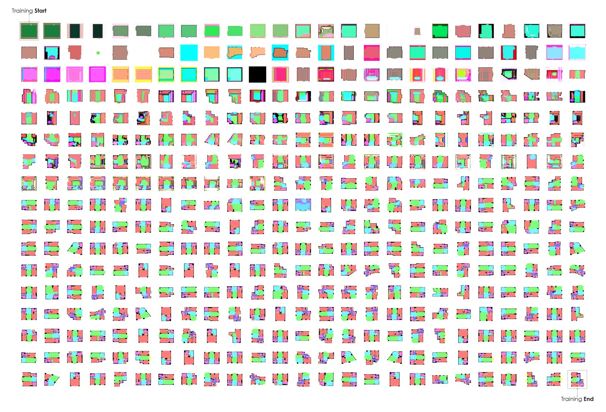

ref

https://towardsdatascience.com/ai-architecture-f9d78c6958e0

# AI & Architecture

#### 실험적 관점

<GAN-Generated Masterplan>

인공 지능은 한 분야로서 수많은 분야에 이미 침투 해 왔으며 산업 전반에 걸쳐 이전에 해결되지 않은 과제에 대한 수단과 방법을 제시했습니다. 이전 기사에서 설명한 AI의 출현은 아직 초기 단계지만 유망한 결과를 제공합니다. 단순한 기회 이상으로, 그러한 잠재력은 건축 분야를 재 형성하려는 주요 단계입니다.

우리의 작업은 건축 환경에 적용될 때이 약속을 입증 할 것을 제안합니다. 특히, 우리는 평면도 분석 및 생성에 인공 지능을 적용 할 것을 제안합니다. 우리의 궁극적 인 목적은 (1) 바닥 계획을 생성하는 것, 즉 매우 다양하고 다양한 바닥 계획 설계의 생성을 최적화하는 것, (2) 바닥 계획을 수립하는 것, 즉 사용자를 허용하는 적절한 분류 방법론을 제공하는 것 (3) 생성 된 디자인 옵션을 "탐색"할 수 있습니다.

우리의 방법론은 두 가지 주요 직관을 따른다. (1) 표준 최적화 기법을 포함하고 있지만, 건물 계획의 작성은 단순한 기술적 인 문제이며, (2) 공간 설계는 순차적 인 과정이므로 다른 규모 (도시 규모, 건물 규모, 단위 규모). 그런 다음이 두 가지 현실을 활용하기 위해 중첩 된 Generic Adversarial Neural Networks 또는 GAN을 선택했습니다. 이러한 모델을 통해 우리는 마주 치는 평면도에서 더 많은 복잡성을 포착하고 연속적인 단계를 통해 문제를 해결함으로써 복잡성을 줄일 수있었습니다. 이 특정 작업에 대해 특별히 훈련 된 주어진 모델에 해당하는 각 단계는 결국 사람과 기계 간의 앞뒤로 가능한 증거가 될 수 있습니다.

계획은 실제로 정량적 기술의 십자가에서의 고차원적인 문제이며,보다 질적 인 특성입니다. 건축 전례에 대한 연구는 분석 프로세스가 부족하면서 기존 자원의 풍부함을 부인하는 위험한 프로세스로 남는 경우가 많습니다. 현재의 데이터 과학 방법론에서 영감을 얻은 방법론은 적격 층 계획을 목표로합니다. 6 개의 측정 항목을 작성하여 구조적으로 관련성이 높은 평면도를 캡처하는 프레임 워크를 제안합니다. 한편, Footprint Shape, Orientation, Thickness & Texture는 주어진 평면도의 스타일의 본질을 포착하는 세 가지 측정 기준입니다. 반면, 프로그램, 연결성 및 유통은 모든 평면도 구성의 본질을 묘사하기위한 것입니다.

요컨대, 일단 연필을 확장 한이 기계는 오늘날 건축 지식을 매핑하는 데 활용 될 수 있으며 실행 가능한 설계 옵션을 작성하는 데 도움을주기 위해 교육을 받았습니다.

## I. 프레임 워크

우리의 연구는 건축과 인공 지능의 교차점에서 발견됩니다. 전자는 주제이고, 전자는 주제입니다. 둘 다 명확하고 실행 가능한 범주로 단순화되었습니다.

건축은 스타일과 조직의 교차점으로 이해됩니다. 한편으로는 건축물을 기하학, 분류학, 유형학 및 장식을 통해 특정 스타일로 표현하는 문화적 중요성의 매개체로 간주합니다. 바로크, 로마식, 고딕 양식, 현대식, 현대식 : 평면도를 면밀히 조사하여 찾을 수있는 많은 건축 스타일. 다른 한편, 건물은 공학과 과학의 산물이며, 우리가 평면도를 읽을 때 발견 할 수있는 엄격한 구조와 규칙 (건축 코드, 인간 공학, 에너지 효율, 출구, 프로그램 등)에 응답합니다. 이러한 조직적 요구는 아키텍처에 대한 정의를 완료하고 조사를 진행합니다.

인공 지능은 조사 도구의 두 가지 주요 조사 영역 (분석 및 생성 적 적자 네트워크)을 사용하여 고용 될 것입니다.

우선, 우리는 Generation이라는 주제로 뛰어 들어갈 것입니다. GAN을 사용하여 우리는 AI 시스템을 건축 설계 교육을 제공합니다. 우리는 그 활용이 건축 분야의 관행을 향상시킬 수 있다고 가정합니다. 이 필드는 실험적이며 최근의 놀라운 결과에 달하는만큼 최근의 것입니다. 우리의 희망은 실제 건물 평면도를 그릴 수 있도록 훈련시키는 것입니다.

<Framework Matrix | Source: Author>

그런 다음 생성 된 평면도를 검증하고 분류하기위한 견고한 분석 프레임 워크를 마련 할 것입니다. 궁극적으로 우리의 목표는 GAN의 결과를 구성하여 사용자가 다양한 디자인 옵션을 원활하게 탐색 할 수있는 가능성을 제공하는 것입니다. 이를 위해 데이터 과학이 제공하는 도구의 양과 편재성이 우리 조사에 가치가있을 것입니다.

이 듀얼 렌즈를 통해 Style & Organization, Qualification & Generation의 교차점에서 우리는 Architecture & AI의 만남을 조직하는 기본 틀을 마련했습니다.

## II. Generate

II. 일으키다

건축 평면도의 설계는 아키텍처 실무의 핵심입니다. 그것의 숙달은 규율의 황금 표준으로 서 있습니다. 그것은 실무자들이 잔업하게 기술을 통해 향상 시키려고 노력한 운동입니다. 이 첫 번째 부분에서는 AI를 바닥 계획 생성에 적용 할 수있는 잠재력에 대해 살펴 봅니다.

우리의 프레임 워크를 사용하여 평면도의 스타일과 조직을 다루기 위해 다음 장에서 AI 가능 공간 계획의 잠재력을 설명합니다. 우리의 목표는 이러한 접근 방식의 잠재력을 입증하고 가정을 테스트하기위한 신뢰할 수 있고 견고한 도구 모음을 제공하는 것입니다.

여기서 도전 과제는 세 가지입니다. (1) 올바른 도구 세트 선택, (2) 기계에 표시 할 적절한 현상 분리, (3) 기계가 제대로 "학습"하는지 확인하는 것입니다.

### AI & Generative Adversarial Neural Networks

인공 지능 & Generative Adversarial Neural Networks

Generative Adversarial Neural Networks 또는 GANs가 우리의 선택의 무기입니다. 인공 지능 분야에서 뉴럴 네트워크는 주요 조사 분야입니다. 그러한 모델의 창의력은 Generative Adversarial Neural Networks의 출현을 통해 최근에 입증되었습니다. 어떤 기계 학습 모델처럼 GAN은 제시된 데이터 중에서 통계적으로 중요한 현상을 학습합니다. 그러나 GAN은 Generator와 Discriminator의 두 가지 핵심 모델로 구성되어있어 두 모델간에 피드백 루프를 활용하여 관련 이미지를 생성하는 기능을 개선합니다. Discriminator는 일련의 데이터에서 이미지를 인식하도록 훈련되었습니다. 제대로 훈련 된이 모델은 데이터 세트에서 가져온 실제 예제와 외부의 "가짜"이미지를 구분할 수 있습니다. 그러나 Generator는 동일한 데이터 세트의 이미지와 유사한 이미지를 생성하도록 교육되었습니다. Generator가 이미지를 생성 할 때 Discriminator는 출력물의 품질에 대한 피드백을 제공합니다. 이에 따라 Generator는 더욱 사실적인 이미지를 생성하기 위해 적응합니다. 이 피드백 루프를 통해 GAN은 관찰 된 데이터에서 발견되는 현상을 고려하여 관련 합성 이미지를 만드는 능력을 천천히 구축합니다.

<Generative_Adversarial_Neural_Network’s_Architecture>

### 표현 및 학습

GAN이 우리에게 엄청난 기회를 제공한다면, 무엇을 보여줄지 아는 것이 중요합니다. 모델을 평면도 이미지에서 직접 배울 수있는 기회를 얻었습니다. 이미지 포맷팅을 통해 우리는 모델이 배울 정보 유형을 제어 할 수 있습니다. 예를 들어, 우리 모델에 소포의 모양과 연관된 건물 풋 프린트를 표시하면 소포의 모양이 주어지면 일반적인 건물 발자국을 만들 수있는 모델이 생성됩니다. 산출물의 품질을 보장하기 위해 우리는 우리 자신의 건축 감각을 사용하여 교육 세트의 내용을 관리합니다. 모델은 건축가처럼 우리가 제공 한 데이터만큼이나 우수합니다.

아래에서는 전형적인 교육 과정을 설명합니다.이 과정은 교육 과정의 절반과 절반 동안 실현되며, GAN 모델 중 하나가 방을 배치하는 방법과 주택 단위에 대한 fenestration을 점진적으로 학습하는 방법을 보여줍니다.

<Training_Sequence>

